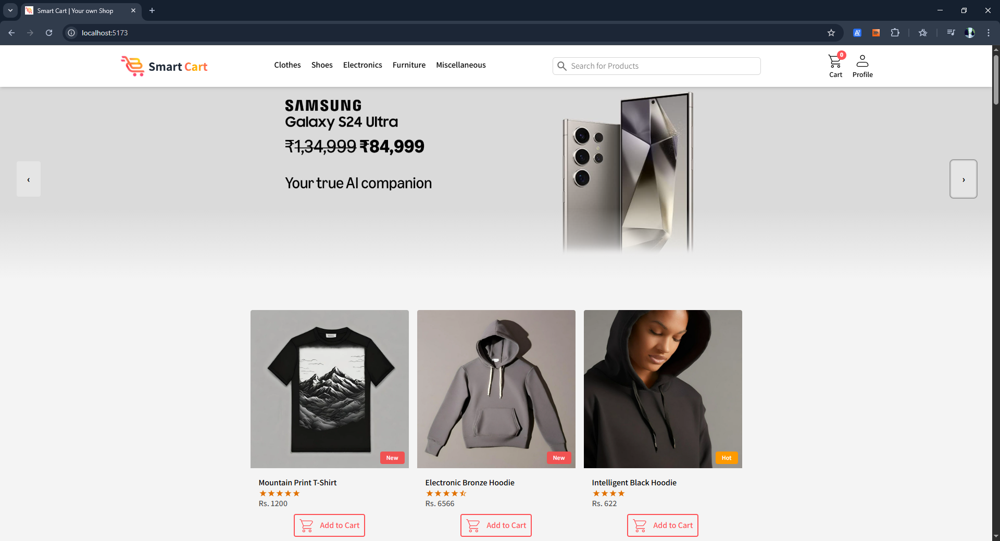
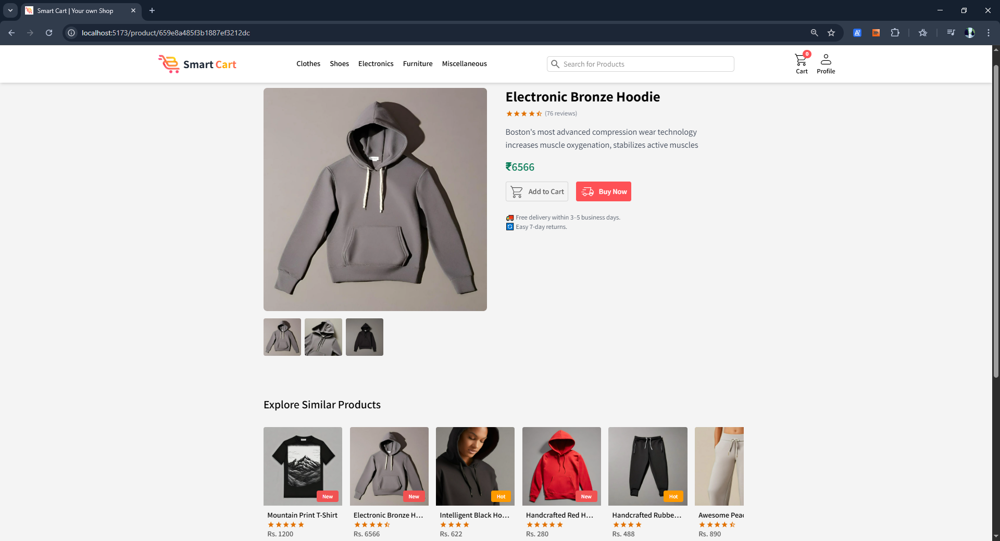
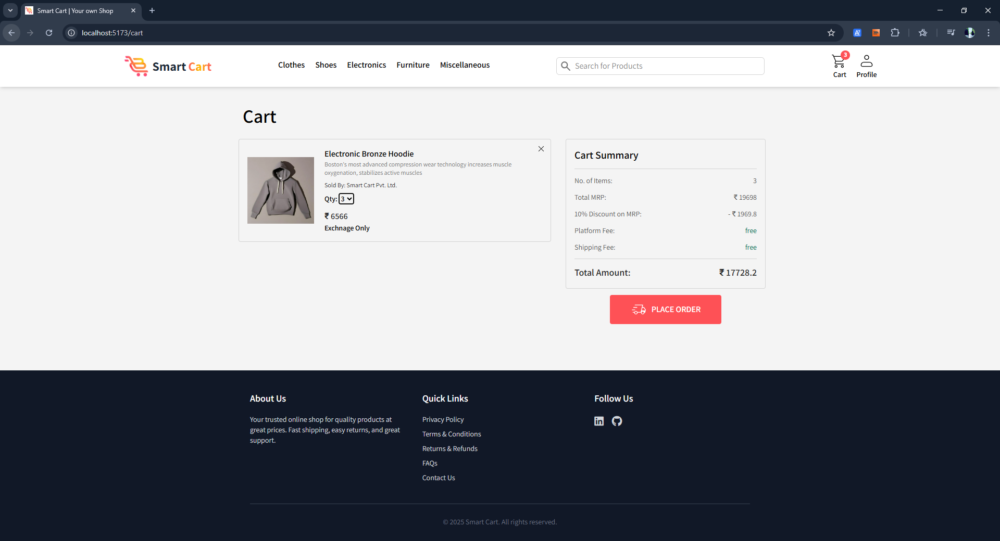

# 🛒 Smart Cart – Your Modern eCommerce Solution

Smart Cart is a fully responsive eCommerce website built with React and Redux. It provides a seamless shopping experience with dynamic product pages, cart management, category-based browsing, and more. Designed to be fast, intuitive, and mobile-friendly.

---

## 🚀 Features

- 🔍 Product Listing with Search & Filter
- 🛍️ Add to Cart, Quantity Management
- 🗃️ Browse by Categories
- 🧾 Product Detail Pages with URL Routing
- 💾 Cart Persistence using `localStorage`
- 📱 Responsive Design (Mobile / Tablet / Desktop)
- ⚡ Optimized for Performance
- 🔄 Auto-updating Carousel with Pause-on-Hover
- 🔗 Deep Linking to Product Pages
- 🎨 Styled with Tailwind CSS

---

## 📸 Screenshots







---

## 🛠️ Tech Stack

- React
- Redux Toolkit
- React Router DOM
- Tailwind CSS
- Vite (or CRA if you're using that)
- Netlify for deployment

---

## 📦 Installation

### 1. Clone the repo

```bash
git clone https://github.com/srk384/Smart-Cart-Redux.git
cd Smart-Cart-Redux
